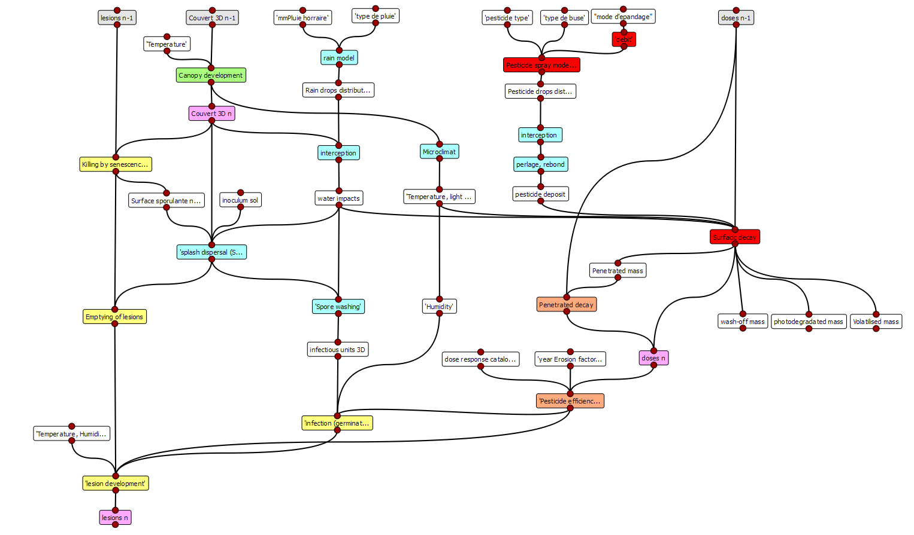
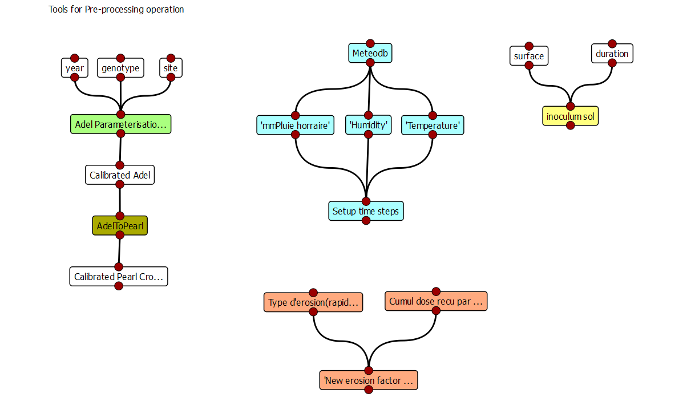
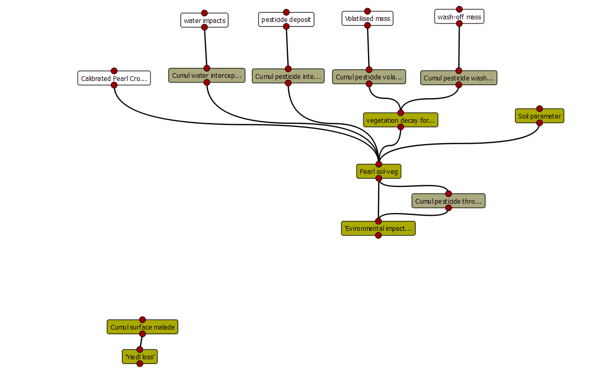
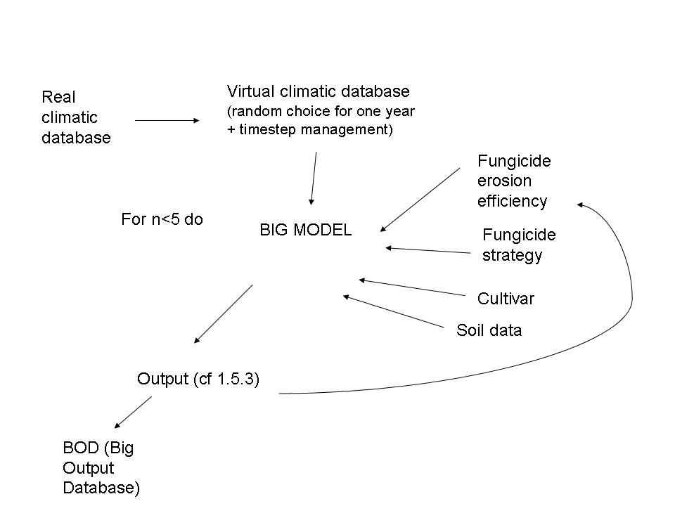

Presentation of the Echap package
#################################

The Echap package is organised in modules following project's workpackages. 

Modules will be combined in data-flows to get applications dedicated to the simulation of a given system/task. 
Foreseen applications are : 
 * An application simulating the processes occuring every day/hour in the vegetation during a whole season : "The Annual loop". It combines a 3D crop growth model with a model of disease dynamics responding to pesticide and a model of pesticide deposit/degration in the canopy.
 * An application simulating at a daily time step the fate of pesticide in the environment (soil + canopy) during a whole crop growth season. It could be run either independantly of the annual loop using simple hypothesis on pesticide deposit/degradation in the canopy ("Pearl/Przm simple"), or re-use the output of the anual loop to force the decay of the pesticide in the canopy to mimics the one computed in the annual loop ("Pearl/Przm detailed").
 * Applications dedicated to the pre-processing of data to get consitent and homogeneous parameterisation of the soil and of vegetation dynamics models("Preprocessing tools").
 * The post-processing utilities, needded to compute synthetic variables and indices from one year simulation outputs ("post-processing tools")
 * An application allowing to perform virtual experimentduring several years ("multi-year loop)

The Annual loop
===============

Conceptual dataflow simulating one year experiment on a 3D Architecture.
 
Pre-processing utilities
=======================

Conceptual dataflow showing the different tools needed for pre processing

  *  3D canopy calibration from experimental data allows Adel to simulate 3D development during the annual loop
  * Adel calibration could also be used to derive parameters for Pearl CropGrowth Table and Przm vegetation parameter 
  * Meteorological data are to be sceanned to construct the time-step table for the nnual loop (one or several steps par day, depending on the rain/spraying events)
  * The erosion factor of coumpounds that will be used during the simulation can be computed prior simultions using the cumulative dode experienced by strains and the type of response of strins to evolutionary pressures
  * for parameterising the soil, a possibility will be to use data from Katrin Oorst (PhD), that estimated hydrodynamic parameters of Boigneville soil (parameters of vanGenuchten equations). These equations could be used to derive more simple parameters of the soil in PRZM.

Post-processing utilities
=======================

Post processing allows to run complementary computation after an annual loop is completed. They include : 
  * Computation of pesticide fate into the soil (pearl) or soil+ air if not computed during the annual loop
  * Computation of yield loss, depending on desease severity

Multi-year experiments
======================

