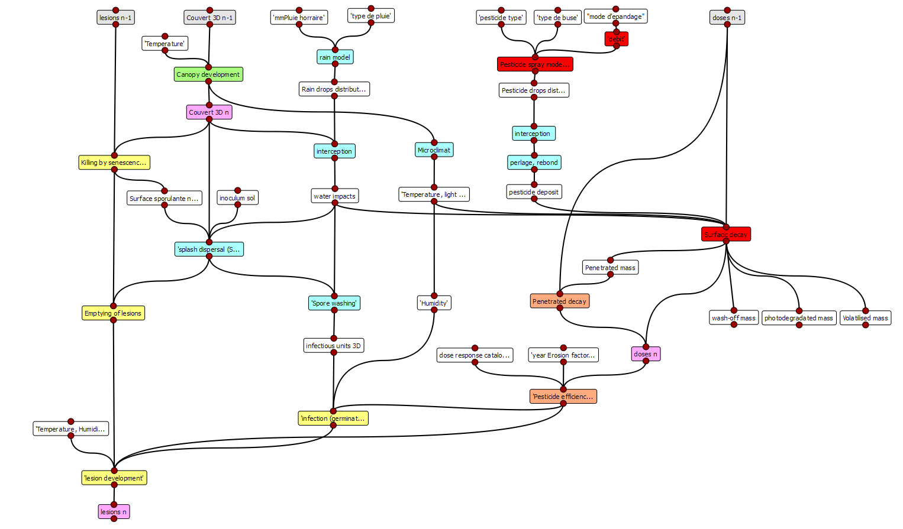
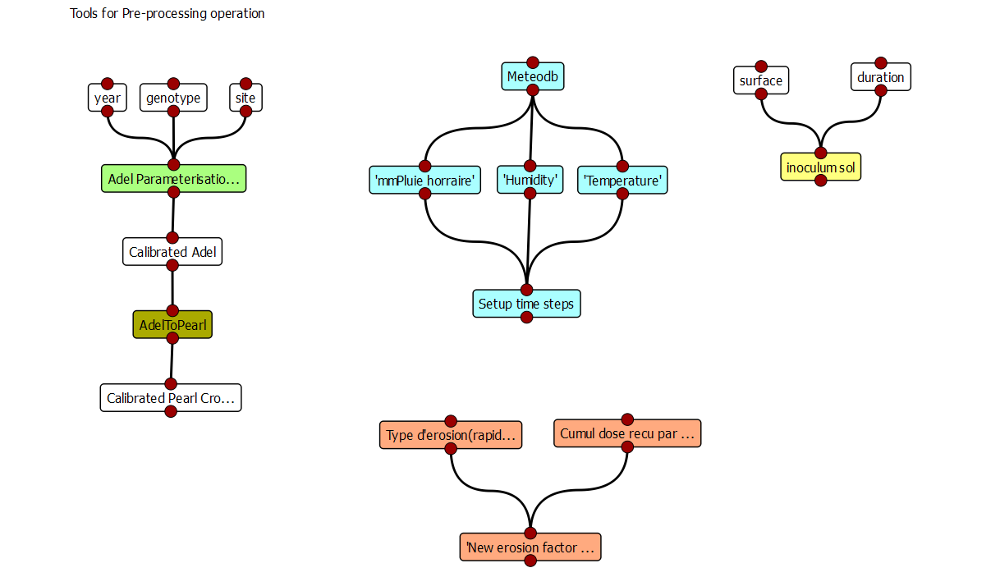
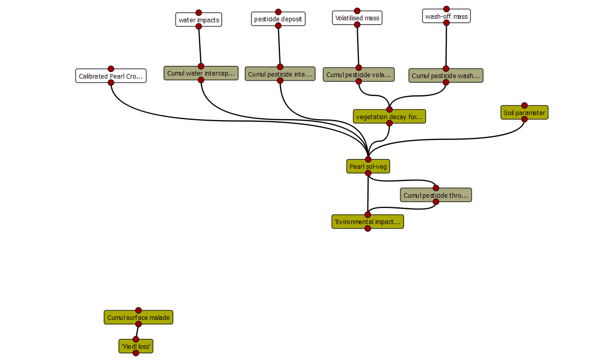
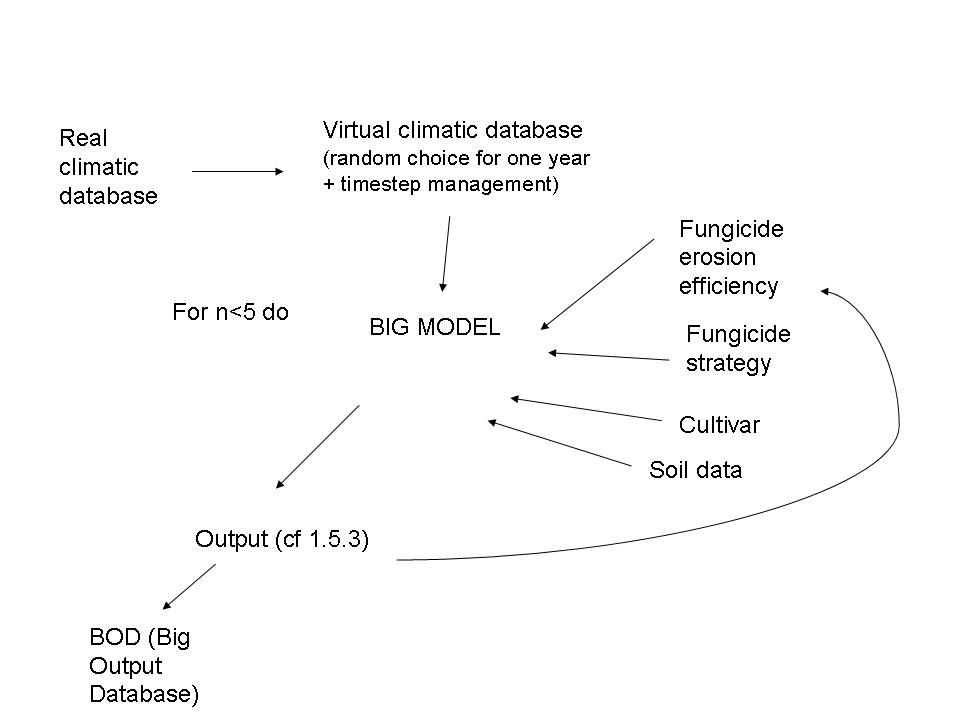

Presentation of the Echap package
#################################

The Echap package is organised in modules following project's workpackages. 

The composition of modules into applications is presented here. They are slit into four kind of compositions : 
 * The sequence of operation occuring every time step when simulating the dynamic of the system for one year ("Annual loop")
 * The pre-processing utilities (for calibration, partial validation) needed to compute parameters before launching a annnual simulation ("pre-processing tools")
 * The post-processing utilities, needded to compute synthetic variables and indices from one year simulation outputs ("post-processing tools")
 * The sequence of operation occuring when running a multi-year virtual experiment("multi-year loop)

The Annual loop
===============

Conceptual dataflow simulating one year experiment.
 
Pre-processing utilities
=======================

Conceptual dataflow showing the different tools needed for pre processing

  *  3D canopy calibration from experimental data allows Adel to simulate 3D development during the annual loop
  * Adel calibration could also be used to derive parameters for Pearl CropGrowth Table
  * Meteorological data are to be sceanned to construct the time-step table for the nnual loop (one or several steps par day, depending on the rain/spraying events)
  * The erosion factor of coumpounds that will be used during the simulation can be computed prior simultions using the cumulative dode experienced by strains and the type of response of strins to evolutionary pressures

Post-processing utilities
=======================

Post processing allows to run complementary computation after an annual loop is completed. They include : 
  * Computation of pesticide fate into the soil (pearl) or soil+ air if not computed during the annual loop
  * Computation of yield loss, depending on desease severity

Multi-year experiments
======================

