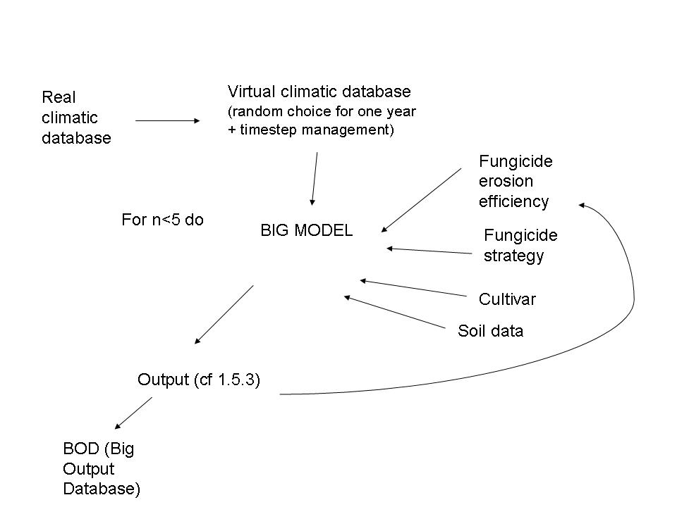

. _echap_scenarii:

.. ..test
WP6 : Scenarii
############################

:Version: |version|
:Release: |release|
:Date: |today|

Description
=============
What we do in this WP6 ?

Run *Big model* for validation. Not possible to make a real validation against experimental data but we must define a policy for checking Big Model output consistency/credibility.
(expert validation for certains parts (Pearl)/comparison decay curve : particular scenarii that give results than can be expertised needed to be defined, who runs ?)

Run *Big model* on a range of combination of genotypes and fungicide applications strategies, each time for a sequence  of climatic conditions representing 5 (?) years  to generate a database that will be used to analyse the environmental impact and productivity impacts of genotypes* fungicides stratrégies

Analyse the output data base to 

-	identify general trends by exploratory statistics such as ACP and regression analysis
-	identify appropriate genotypes * application strategies that lead to the best compromises between productivity and environmental impact. This will rise the difficulty of ranking according to several criteria. 

For this we may think to associate a positive or negative value to each variable (impact, yield, erosion of pesticide efficiency) and rank according to the cumulated value but we do not know if this is valuable.

An alternative way is to identify questions than can be answered unequivocally for instance “create a subset of the database according to one column, rank lines according to a column” an example is “amongst all scenariis with yield more than 90% of the maximum, which is the one with lower pesticide leach ?”

Proposal for the input
======================

- The meteorological database will be that for Grignon or other in Paris region : temperature, PAR (or Rg), rain (cf TODO list)
- What about UV ? question to WP5 = how to estimate the input in UV radiation from the Meteorological database
- Treatment strategies : the same than tested in Boigneville
- Cultivar description : only cultivar for which an full ADEL description is available can be used
- If necessary : Virtual climatic or 5 years climatic sequencies will be generated by mixing sequencies original climatic data
- Erosion efficiency of the pesticides 
- What about soil ?

First proposal for the output table to be analysed
======================

One line per year of simulation. Each line consists in

Variables describing the conditions

- scenario definition : identifier + variables describing the scenario (type of fungicide, total dose...)
- genotype definition : identifier + variables describing the genotype (height, stature,..)
(Choice of descriptive variables will impact the type of analysis
one year climate (identifier + variables describing globally the climate - cumulated rain, mean temperature...)

Variables describing the results 

- Yield (or yield loss ?)
- quantity of spores
- quantity of fungicide emitted in the atmosphere
- quantity of fungicide in the soil
		qt stored in the soil
		wash off 
		if secondary products : same (stored and wash off)
- quantity of fungicide absorbed by the plant
- quantity of fungicide photodegradated
- pesticide efficiency erosion resulting from this year

first lines for data analysis
=============================

The table with yearly variables will be used for exploratory analysis and for building a table with variable integrated over 5? years that will serve for ranking genotytpe + fungicide application strategies

:TODO: 

Define explicitely the list of input data that have to be given for running one year simulation with *Big model*

Are there some input depending on output of previous year ? ( at least : erosion of pesticide efficiency)

Write an example of input file to be validated by the consortium

Define explicitely the list of output data that have to be stored as output of a one year simulation. 

Validate by expert procedure of ranking and 5 years aggregation

The consortium must decide the method for checking *Big model* overall consistency.
*Big model” simulations (daily ? hourly ?). Define the method for estimating data at this time step from the data existing in meteorological databases.

 

:MISCEALLENOUS:

It will be necessary for the project to store some of the daily output data (eg daily time curse of lai, epidemics, pesticide leach, etc). This will be required first for checking model behavior, then for exploring the processes).
List of daily variable to be monitored by the various modules is to be defined.
Tools for visualizing the time curse of these variables must be developped (By who ?)

How to know the daily (hourly ?) income in UV radiation ?

The pesticide that is incroporated in the plant will go to the soil because plant residues are incorporated ine the soil after harvest. So WP pesticide should define how to simulate the ultimate fate of these products.

 

Scenario
=======================

